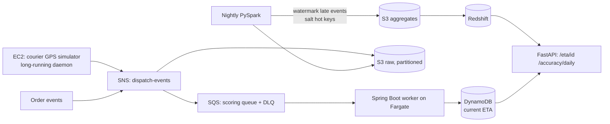

# Architecture

## Data flow notes

- The Fargate worker only ever writes the *current* ETA — it never touches history. History correction (for late-arriving GPS events) happens only in the nightly Spark replay.
- Salting: hot restaurant keys are split into N sub-keys during the Spark shuffle, then re-aggregated — this is the fix for the skew challenge described in the README.
