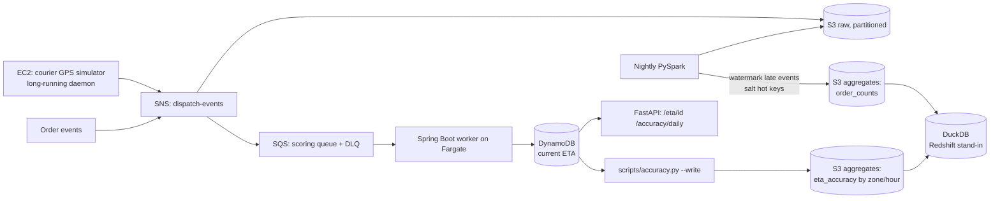

# Architecture

## ASCII — execution flow

```
  src/ingestion/data_gen.py
    order events + courier GPS pings (EC2-daemon equivalent)
             |
             v
  src/ingestion/publisher.py
             |
             v
        SNS dispatch-events
             |
             v
   SQS scoring queue  (+ DLQ on failure)
             |
             v
  src/worker/.../EtaScoringWorker.java (Spring Boot on Fargate)
    consume batch --> compute ETA
             |
             v
   DynamoDB eta-current   (worker only ever writes the CURRENT eta —
             |              history correction happens only below)
             |
             |         all raw events also land in --> S3 (partitioned)
             |                                              |
             |                                              v
             |                              nightly src/transformation/replay.py (PySpark)
             |                                watermark late GPS arrivals,
             |                                salt hot restaurant keys
             |                                              |
             |                                +-------------+-------------+
             |                                v                           v
             |                    S3 dispatch-agg/order_counts   scripts/accuracy.py --write
             |                    (src/transformation/replay.py)   --> S3 dispatch-agg/eta_accuracy
             |                                |                           |
             |                                +-------------+-------------+
             |                                              v
             |                          src/utils/warehouse.py :: DuckDB
             |                            (Redshift stand-in, offline/warehouse queries only)
             v
  src/serving/api.py :: FastAPI
    /eta/{order_id}   (reads eta-current live)
    /accuracy/daily   (computes MAE live from eta-current + events, not the persisted aggregate)
```

## Mermaid (same flow)



## Data flow notes

- The Fargate worker only ever writes the *current* ETA — it never touches history. History correction (for late-arriving GPS events) happens only in the nightly Spark replay.
- Salting: hot restaurant keys are split into N sub-keys during the Spark shuffle, then re-aggregated — this is the fix for the skew challenge described in the README.
- Two aggregates land in `s3://dispatch-agg/`: `order_counts` (written by `src/transformation/replay.py`, no zone/hour breakdown) and `eta_accuracy` (written by `scripts/accuracy.py --write`, grouped by a coarse lat/lon zone grid and hour-of-day). Both are Parquet, queried the same way through DuckDB (`src/utils/warehouse.py`) — this repo's local stand-in for a Redshift Spectrum/COPY query, not a live Redshift cluster.
- `/accuracy/daily` computes MAE live from `eta-current` + the events file on each call — it does not read the persisted `eta_accuracy` aggregate. The persisted aggregate is for offline/warehouse querying via `make query`-style DuckDB SQL, not the live API path.
